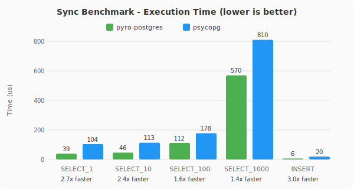

# pyro-postgres

A high-performance PostgresQL driver for Python, backed by Rust.

- [Documentation](https://elbaro.github.io/pyro-postgres/)
- [Benchmarks](https://github.com/elbaro/pyro-postgres/tree/main/benchmark)

